## 写在前面
在此前我使用的是搜狗拼音输入法，这东西从小学四年级陪我到现在，已经记录了我很多年的输入习惯。

虽然功能强大，但愈发严重的广告和隐私问题让我逐渐失去了兴趣。

尤其是我不止一次遇到输入法钩子导致别的程序崩溃的情况，这让人非常头疼。

（虽然我也不太清楚具体的原因是什么，如果有懂的朋友可以在评论区告诉我一下）

我也曾经更换过微软拼音，很多人也说 Windows 11 下的微软拼音已经有了很大的改进，但我个人感觉还是不够好用，尤其是输入效率和词库方面。

在折腾 Linux 的那几天，在寻找 Linuxmint 默认输入方案的替代品时，我发现了中州韵输入法和雾凇拼音词库的组合，经过一段时间的使用，我觉得这是一个非常不错的替代方案。

现在我已经换回了 Windows 11 系统（出于各种原因吧，主要是为了玩游戏），思考了一下还是可以沿用这个组合的，于是就有了这篇文章。

## 中州韵输入法
RIME（中州韵输入法）是一个开源的输入法框架，支持多种输入方案和平台。它的设计理念是“输入即编程”，允许用户通过配置文件来自定义输入方案和词库。

他们致力于让用户喜欢上打字，享受打字的乐趣，而不是被迫去适应输入法的各种限制和广告。

中州韵的 Windows 客户端叫做 **小狼毫**（Weasel）。这倒是个很有趣的名字。

小狼毫的输入界面有点类似于微软拼音，你可以自己选择喜欢的配色。

### 输入法安装

**中州韵输入法官网：[rime.im](https://rime.im/)**

支持 **Windows 8.1+** 系统，下载后直接安装即可。

演示系统：Tiny10 23H1 x64

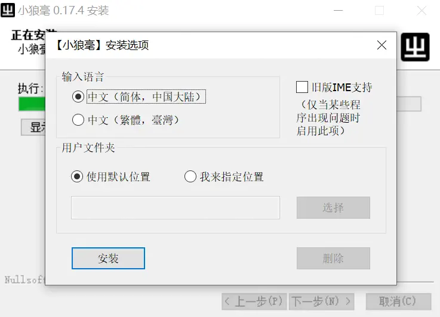
这里保持默认设置不变。

之后会弹出「可以使用【小狼毫】写字」了，之后来到输入法设置界面，下图中的这些输入方案我们都不需要，之后我们会使用雾凇拼音词库来替代它们。
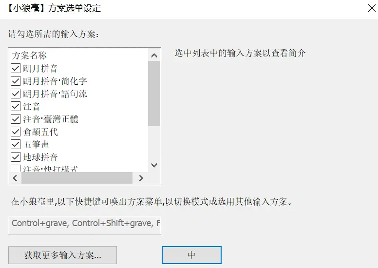

然后选择一个你喜欢的皮肤，这里我选择 Google 。
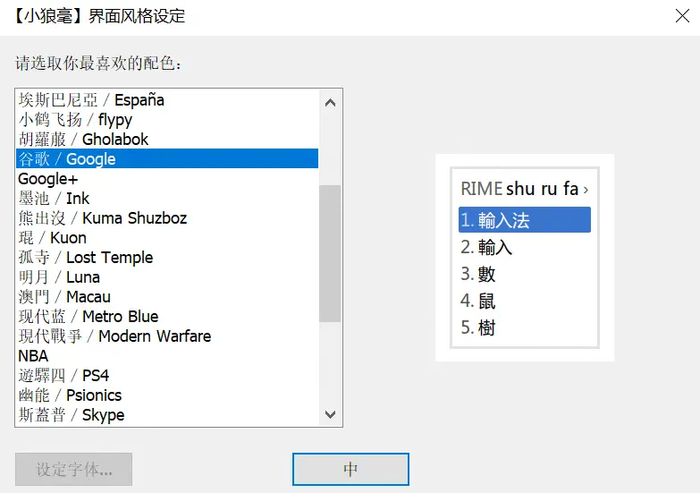

进入 Windows 系统设置，将默认键盘修改为小狼毫。
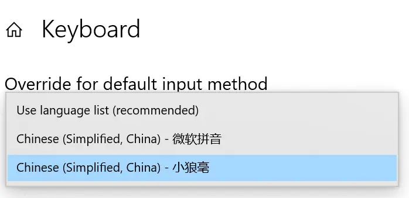

到这里，小狼毫输入法就安装好了。

## 雾凇拼音词库
雾凇拼音基于中州韵输入法提供了一套开箱即用的完整配置，包含输入方案（全拼、常见双拼）、长期维护的开源词库及各项扩展功能。

**雾凇拼音仓库：[Github@iDvel/rime-ice](https://github.com/iDvel/rime-ice)**

### 词库的安装
打开 GitHub 仓库，点击「Code」按钮，选择「Download ZIP」将仓库打包下载成压缩包。
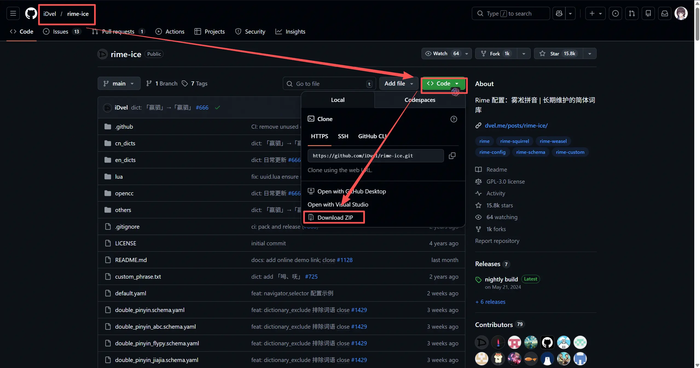

解压后如图：
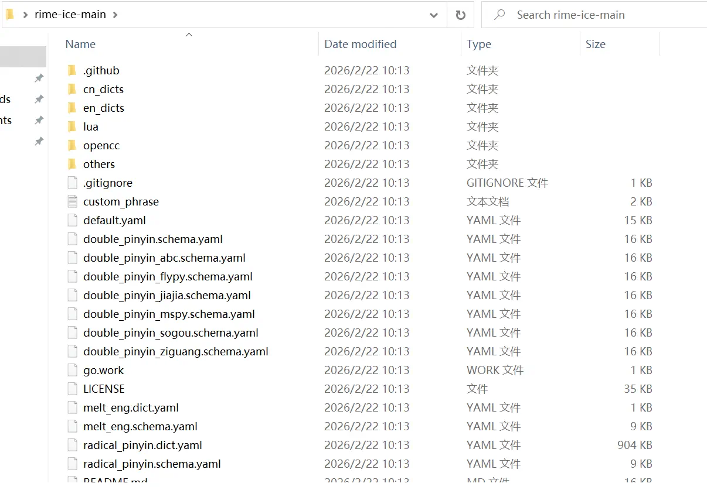

在任务栏中右键「中」字图标，选择「用户文件夹」，进入中州韵配置文件夹。
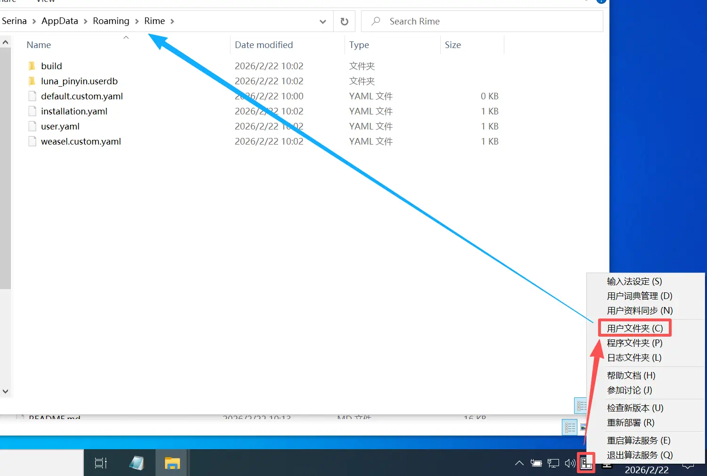

将解压后的所有文件复制到这个文件夹内，并再次右键点击「中」字图标，选择「重新部署」，等待部署完成后就可以使用雾凇拼音了。
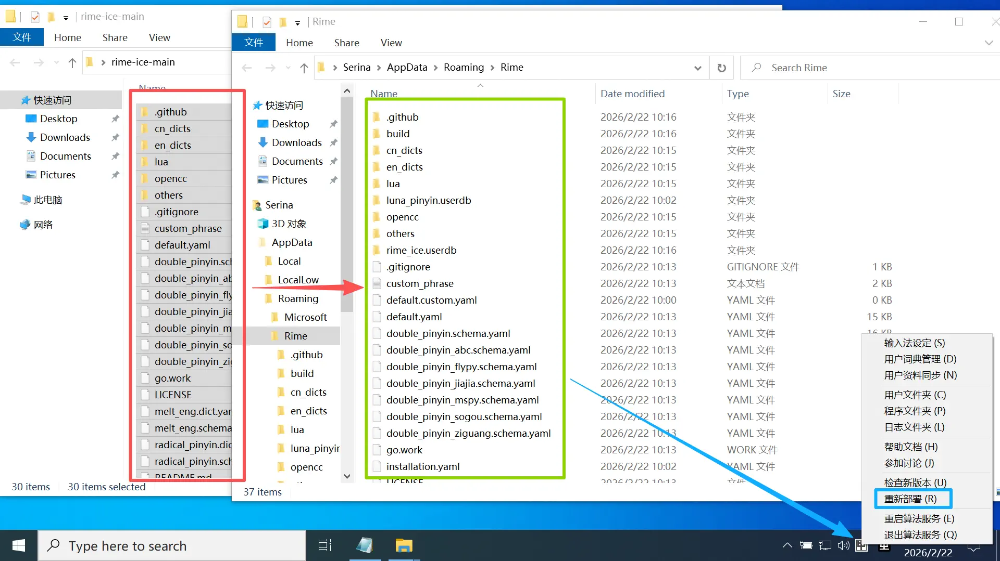

随便打开一个输入界面，输入「wu song pin yin」，如果你的结果与下图类似，那么代表雾凇拼音词库安装成功了。

## 词库的导入
### 深蓝词库转换器
如果你有一些第三方的词库想要导入到中州韵输入法中，可以使用深蓝词库转换器这个工具来进行转换。

比如，搜狗输入法可以导出用户词库为 bin 文件，可以使用转换器导入，无缝衔接新的输入法。

**深蓝词库转换器：[Github@studyzy/imewlconverter](https://github.com/studyzy/imewlconverter)**

在 release 页面下载最新版本的深蓝词库转换器，解压后运行程序即可使用。

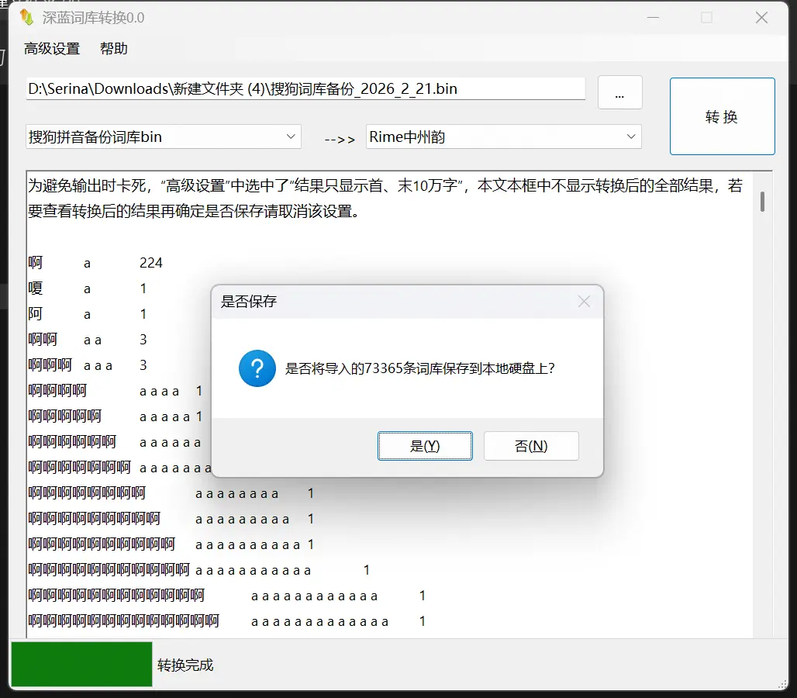

保存后你将得到一个 txt 文件，接下来进行导入。

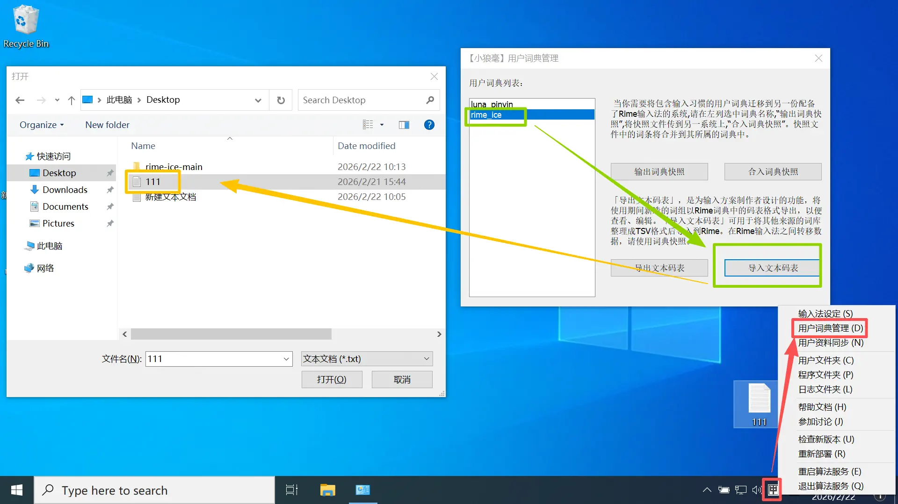

如图，仍然是右键点击「中」字图标，选择「用户词典管理」，选择「rime-ice」，点击「导入文本码表」，将深蓝词库导出的 txt 文件选中并导入即可。
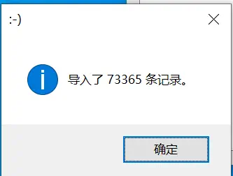

如果你对自己的成分感兴趣的话，也可以导出一份纯文本 txt ，翻一翻自己都输入过哪些词，看看自己的输入习惯是什么样的。
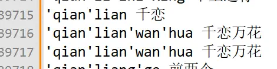

## 结语
至此，基于中州韵输入法和雾凇拼音词库的 Windows 输入方案就搭建完成了。

虽然这个方案可能不如一些商业输入法那样与时俱进，但它的开源和可定制性让它成为了一个非常不错的选择。

如果你也厌倦了商业输入法的广告和隐私问题，不妨试试这个组合，或许会有意想不到的惊喜。

